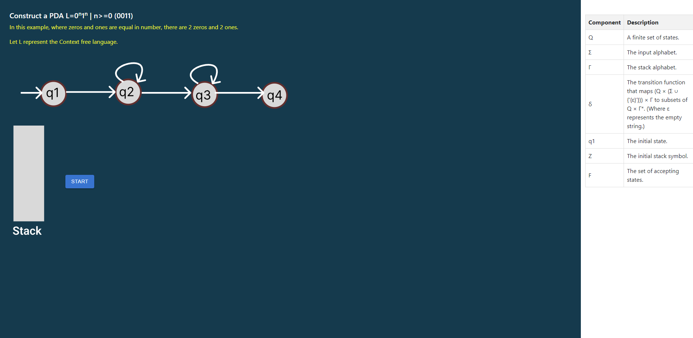
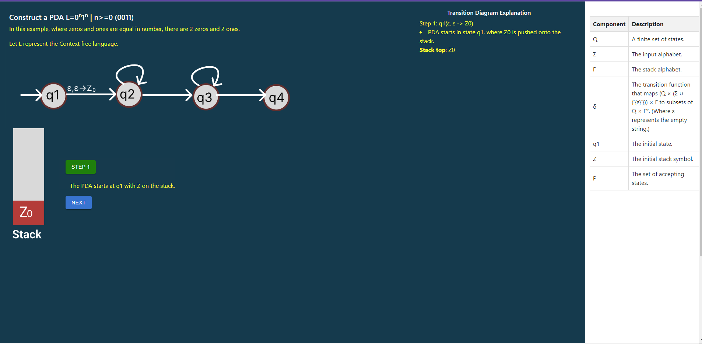
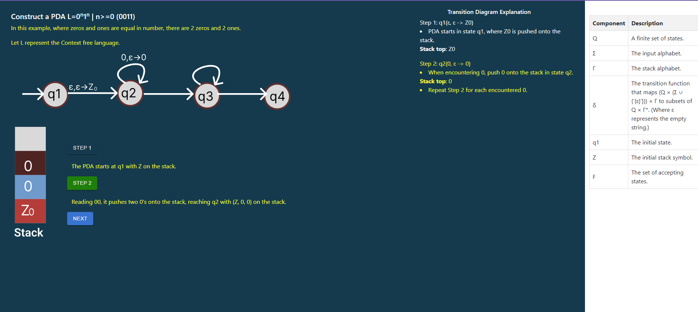
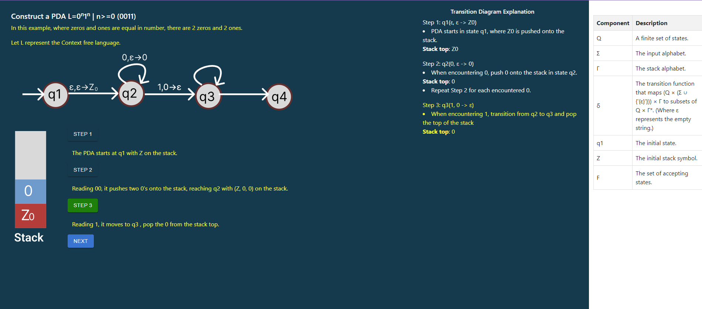
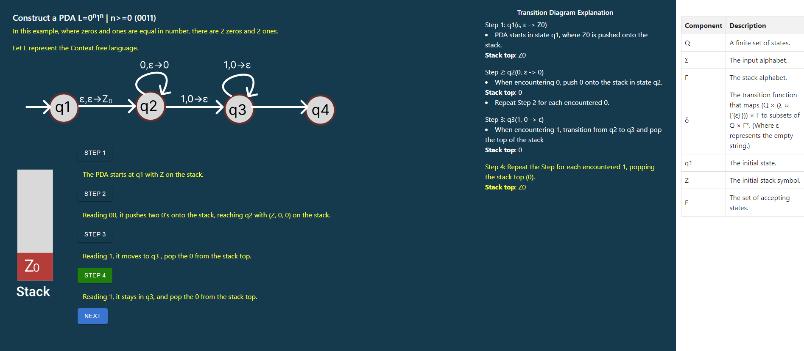
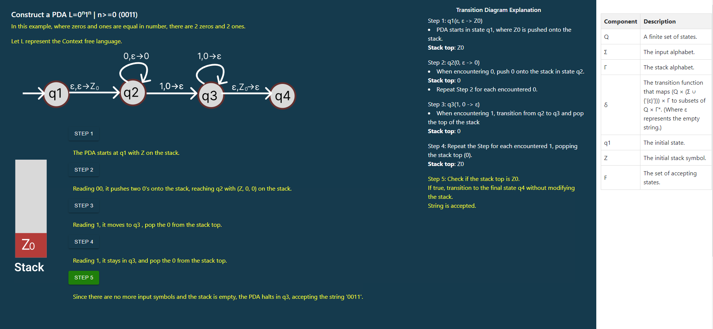

<u><b>procedure</b></u>

construct a pushdown automata for the language L=0n1n | n>=0  

In the given langauge  <b>L=0n1n | n>=0 </b>, the number of zeros and ones are in equal numbers. For example, if we consider the string "0011," the number of zeros and ones are equal.

In the interface, you can observe astate diagram and a stack along with a start button.

Click on the start button to observe the process of constructing a PDA

Carefully observe the state diagram along with the stack to understand the interactions between the stack and transitions between states.

Click on the next button to observe the step-by-step process of constructing a PDA, where you can witness each step progressing to create the PDA.

step1:

step2:

step3:

step4:

step5:

