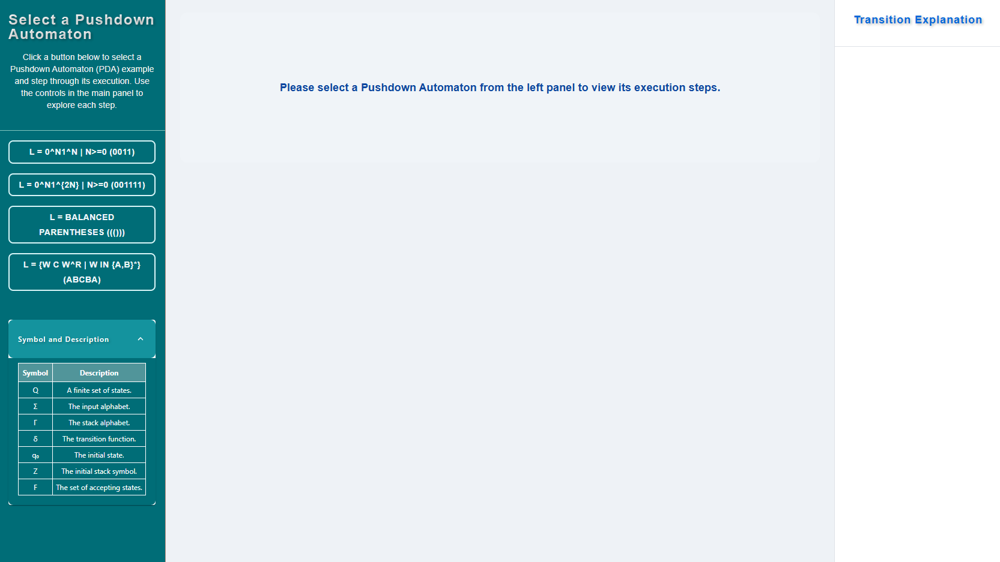
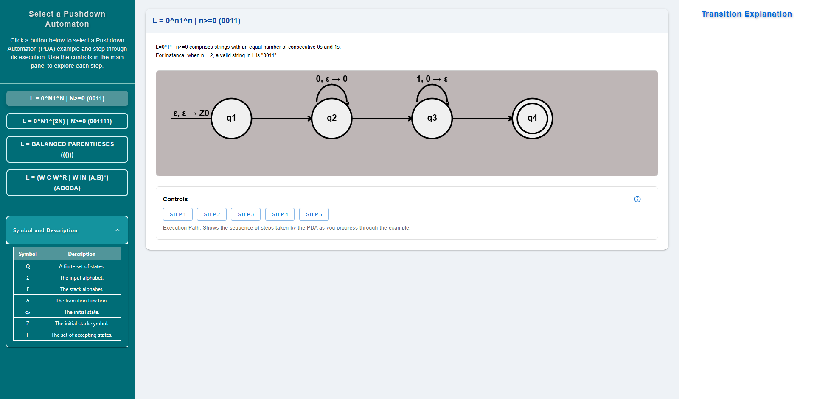
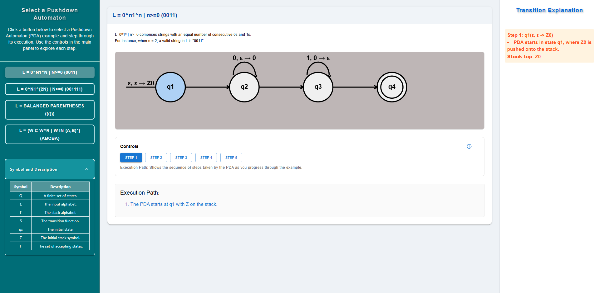
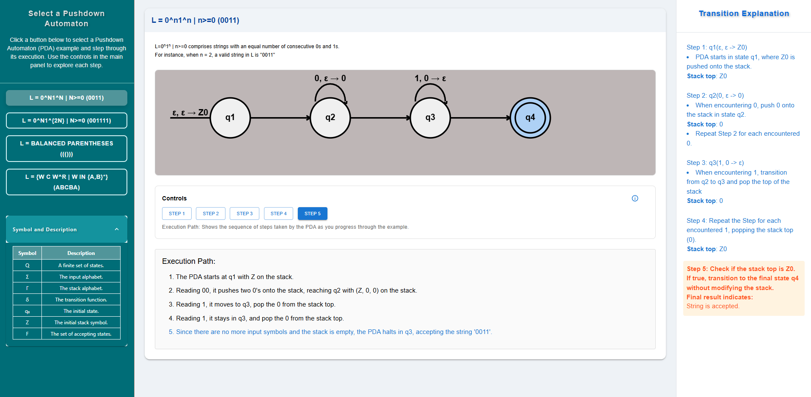

### Procedure

#### Step 1 — Select a Pushdown Automaton
- In the left panel titled “Select a Pushdown Automaton,” click one of the example buttons (e.g., L = 0^n1^n, Balanced Parentheses, or Palindrome W C W^R).
- After selecting, the main (center) panel will load the PDA and its step-by-step execution view.
- The right panel (“Transition Explanation”) updates to show details for the chosen PDA.
- Use the legend at the bottom-left to review symbols: Q, Σ, Γ, δ, q0, Z, F.

#### Step 2 — Select an example and view the automaton
- In the left panel, click one of the example PDAs.
- The center panel loads the PDA diagram (states and transitions).
- Use the Controls below the diagram to step through execution.

#### Step 3 — Click the first step and observe the explanation
- In the center panel, click the first available step (often labeled STEP 1 or Start).
- The automaton highlights the corresponding state/transition.
- The right-side Transition Explanation shows the details for this step (input symbol consumed, stack action, and current stack top).
- The Execution Path below the diagram adds a summary line for this step.

#### Step 4 — Navigate through all steps (dynamic: STEP 1 … STEP N)
- Continue with the step controls (Next/Previous or STEP buttons). The total number of steps depends on the selected example; it is not fixed.
- After each step:
  - Check the Transition Explanation on the right for the current step’s δ-transition, input action, and stack update.
  - Watch the diagram highlight the active state/edge.
  - See the Execution Path grow with each step taken.
- Keep advancing until the final step (often indicated as “Final” or when the machine reaches an accepting configuration). The right panel will show the final acceptance/termination message.

#### Step 5 — Check the result
- Read the final status in the right panel:
  - Accepted if the PDA ends in a state in F and satisfies the example’s stack condition (e.g., empty stack or Z0 at bottom).
  - Rejected otherwise.
- Use Previous/Reset to review steps, try a new input, or select another example.